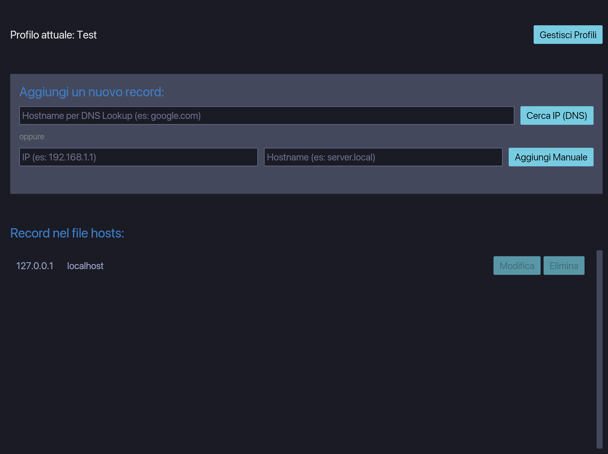

-----

### Host Profiles Manager

**Disclaimer:** This project is a Rust application developed for educational purposes, specifically to explore and learn about GUI development with the [Iced](https://iced.rs/) framework, database management with [SQLite](https://www.sqlite.org/index.html), and cross-platform compatibility. The code is intended as a learning resource and may not be suitable for production environments.

-----

## 📖 About the Project

`Host Profiles Manager` is a cross-platform desktop application that provides a modern and intuitive interface for managing your system's `hosts` file. It allows you to create, switch between, and manage multiple host profiles, making it easy to handle different network configurations (e.g., development, staging, production).

The application is built entirely in **Rust** using the **Iced** GUI framework and a **SQLite** database for persistent profile storage.

## ✨ Key Features

* **Profile Management**: Create, select, update, and delete multiple host profiles.
* **Persistent Storage**: All profiles and their host entries are saved to a SQLite database, ensuring your data is retained between sessions.
* **DNS Lookup**: Easily add new host entries by performing a DNS lookup for a given hostname.
* **Manual Entry**: Manually add or edit host entries with specific IP addresses and hostnames.
* **Seamless Editing**: Modify existing entries directly within the UI, with changes saved automatically to your profile and the `hosts` file.
* **Import/Export Profiles**: Share your host configurations by exporting profiles to a `.json` file and importing them on another machine.
* **Cross-Platform Compatibility**: The application is designed to work on **Windows**, **macOS**, and **Linux**. It correctly identifies the OS to manage the `hosts` file and application data paths.
* **System Permissions Handling**: The application requires administrative privileges to modify the `hosts` file, and it handles the required permissions gracefully on each platform.




## 🚀 Getting Started

### Prerequisites

* [Rust](https://www.rust-lang.org/tools/install) (latest stable version)
* [Git](https://git-scm.com/downloads)

  
### Building from Source

1.  Clone the repository:

    ```bash
    git clone https://github.com/YOUR_USERNAME/YOUR_REPO_NAME.git
    cd YOUR_REPO_NAME
    ```

2.  Build the application in release mode:

    ```bash
    cargo build --release
    ```

    The executable will be located in `target/release/`.

### Running the Application

Since the application needs to modify the system `hosts` file, it must be run with administrative privileges.

* **Linux/macOS**:

  ```bash
  sudo ./target/release/hosts_manager
  ```

  You will be prompted for your password.

* **Windows**:
  Navigate to the `target/release/` folder, right-click `hosts_manager.exe`, and select **"Run as administrator"**.


## 📄 License

This project is licensed under the MIT License. See the [LICENSE](LICENSE.md) file for details.
